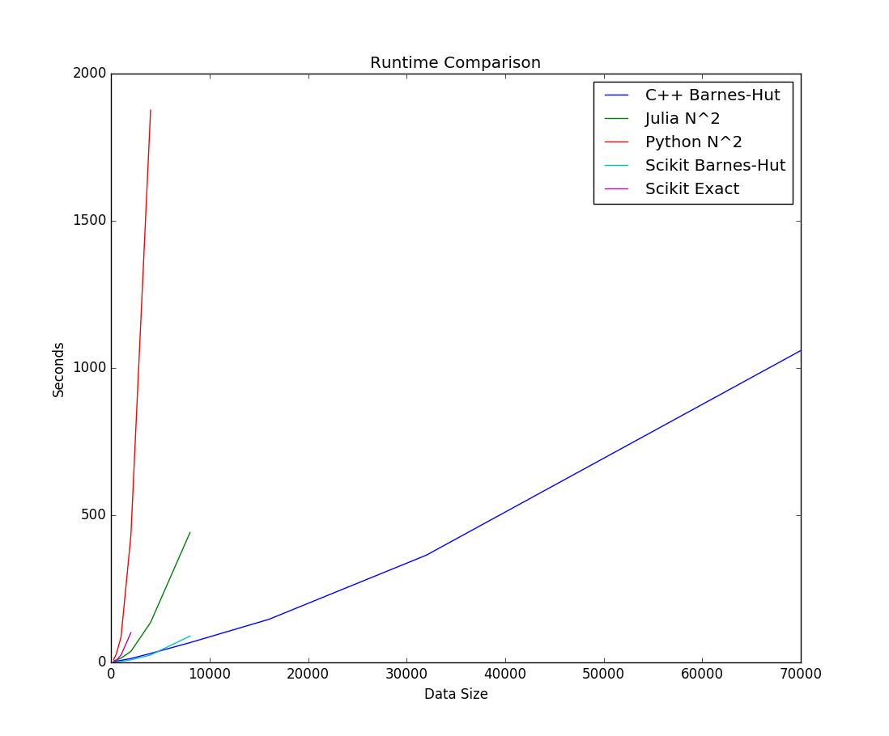

# Motivation

Data sets involving many dimensions are commonplace in scientific computing
and machine learning, however, the human visual system is limited to
interpreting data in only two or three dimensions.  This discrepancy has
motivated much work to develop techniques that represent high-dimensional
information using a low\-dimensional space.  Visualizations such as scatter-
plot matrices and parallel coordinates have proven effective when the number
of dimensions is merely moderate, say 10 or 20 [@viszoo]. However, many
emerging problems involve data sets with hundreds or thousands of dimensions.
Early efforts such as multidimensional scaling [@dimscale] have attempted to
solve the problem of high dimensionality by preserving the original distances
in the low-dimension embedding.  Unfortunately, such techniques have suffered
due to their over\-emphasis on preserving large distances, often at the
expense of distorting local relationships in the data.

Student-T Stochastic Neighbor Embedding (t\-SNE) [@tsne] is an award\-winning
technique for embedding data of high dimension into a 2\-D or 3\-D space,
while preserving local relationships in the original data.  This has yielded
marked improvements in the quality of the embedding, especially with regard to
its ability to preserve clusterings and structure.  As originally outlined by
the author, this algorithm was developed using closed (or finite) data sets,
where all data is available prior to the start of the algorithm. Additionally,
t\-SNE was originally designed to process all available data in batch,
displaying a result only after all points have converged.

In the world of big data, many data sets are open-ended with values arriving
continuously in an unending stream.  The previously described operational mode
of t\-SNE, however, does not readily accommodate the immediate processing of
streaming data.  It is therefore compelling to have a version of t\-SNE which
can accommodate a streaming operational mode, i.e. to incorporate new
information into the embedded representation as it arrives.  Such a system
would allow an operator to observe changes in complex, high-dimensional data
in near real\-time.

The goals of this project, as stated in the original proposal, are:

  1. to experiment with modifications to the t-SNE algorithm that could allow
     it to be used for online processing with streaming data, and
  
  2. to visually demonstrate what a t-SNE visualization might look like when
     applied to real time streaming data.

This report describes the progress made toward these two goals.

# Prior Work

The t\-SNE algorithm was initially described by van der Maaten in 2008
[@tsne], as a way of visualizing data points which lie in a high-dimensional
space (or a metric space) by embedding the data in a low\-dimensional space.
The author describes some of the challenges inherent in dimensionality
reduction and develops some novel approaches. Specifically, van der Maaten
argues that many prior efforts have (perhaps unintentionally) focused on
preserving large distances between points, whereas it is more useful to
preserve small distances within the local neighborhood about a point. In
addition, he demonstrates an approach for overcoming the *crowding problem*,
i.e. where $D+1$ points may be equidistant in a space of dimension $D$, and as
$D$ is reduced from a large to a small value, it is no longer possible to
accurately preserve the distances between points in the reduced space; some
compromises must be made.  The key insight is that, by modeling the distances
between points as joint probabilities of a Gaussian, and matching these
probabilities to a Student\-T distribution in the low dimensional space, the
"fat tails" of the Student\-T distribution can accommodate this crowding
effect (hence the *t* in t\-SNE).

The original t\-SNE paper [@tsne] describes the algorithm using dense linear
algebra and can be shown to have $\mathcal{O}(n^2)$ complexity in both time
and memory.  A later work by van der Maaten [@fast-tsne] improves on this
performance substantially by leveraging vantage point trees [@vptree], a
structure for searching neighborhoods in a metric space, as well as
quad\-trees to accommodate a force approximation technique taken from
gravitational simulations known as Barnes-Hut [@barneshut].  Used together,
these allow the computational and storage complexity to be reduced to
$\mathcal{O}(n \log n)$. Our work in developing a streaming version of t\-SNE
builds on these performance enhancements.

# Overview of t-SNE

The following section gives an outline of both the original [@tsne] and
accelerated [@fast-tsne] versions of the t-SNE algorithm, with a brief mention
of the very recent Approximated t-SNE (A-tSNE) work [@atsne].  In describing
these algorithms we define the following variables:

  - $n$ points,
  - $d$ dimensions,
  - $\mathbf{X}$, a data matrix of size $(n \times d)$, and
  - $\mathbf{Y}$, a corresponding matrix of size $(n \times 2)$ representing
    the 2-D embedding of the original input.

We define the conditional probability between two input points $x_i$ and $x_j$
using Gaussian assumptions as follows:

$$ p_{j|i} = {
    \mathrm{exp}(-||x_i - x_j||^2 / 2\sigma^2_i) 
        \over
    \sum_{k \ne i} \mathrm{exp}(-||x_i - x_k||^2 / 2\sigma^2_i)
} $$

Using the conditional probability above, we define a symmetrized joint
probability as follows:

$$ p_{ij} = (p_{j|i} + p_{i|j}) / 2n $$

Next, we define joint probabilities between the points in the
reduced space.  Because this space has low dimension (typically 2 or 3), the
algorithm employs a Student-T distribution (with 1 degree of freedom) rather
than a Gaussian.  This gives the low-dimension distribution more flexibility
to reposition points which are originally distant, while still encouraging the
preservation of local structure in the high dimensional space.  The
joint probabilities in the low-dimensional space are:

$$ q_{ij} = {
    \mathrm{exp}(-||y_i - y_j||^2) 
        \over
    \sum_{k \ne l} \mathrm{exp}(-||y_k - y_l||^2)
} $$

The optimization process seeks to minimize the Kullback-Leibler (K-L)
divergence [@kldivergence] between these two distributions using a gradient
descent technique by updating the position of the $y_i$ points according to
the following formula:

$$ {\partial C \over \partial y_i} = 4 \sum_j {
    (p_{ij} - q_{ij}) (y_i - y_j)
        \over
    1 + ||y_i - y_j||^2
} $$

where $C = KL(P||Q)$, i.e. the K-L divergence of $p_{ij}$ and $q_{ij}$, which
are the joint probabilities between points in the high\- and low\-dimensional
spaces, as described above.

## Original t\-SNE

Here, we outline the t\-SNE algorithm as originally proposed in [@tsne]:

### Initialization phase

  * Use Principal Component Analysis (PCA) to reduce matrix
    $\mathbf{X}_\mathrm{orig}$ to 50 dimensions (call this $\mathbf{X}$).
  * Compute a standard deviation around each point in $\mathbf{X}$.
    - Identify the neighborhood around each row $x_i$ of $\mathbf{X}$
      by solving for a desired perplexity (default 30) around each point
      using a binary search.
  * Compute pairwise affinities $p_{j|i}$ for each $i,j \in 1 \ldots n$,
    and set $p_{ij} = (p_{j|i} + p_{i|j}) / 2$.
  * Initialize $\mathbf{Y}$ with random normal values drawn from
    $\mathcal{N}(0, 10^{-4} \mathbf{I})$.

### Optimization phase

  * For $i \in 1 \ldots n$
    - Compute the gradient $\partial C \over \partial y_i$.
    - Compute an updated position $y_i^*$ using the gradient.
  * Update all $y_i \leftarrow y_i^*$.
  * Repeat steps in this phase until some convergence criterion is met.

For brevity, some details of the implementation such as "momentum" have been
omitted from this description.

## Accelerated t-SNE

Using certain observations about the relationships between near and distant
points, and combining these with graphical search tree structures, it is
possible to create an optimized version of the t-SNE algorithm without
incurring any appreciable loss of quality [@fast-tsne].  In particular, we
observe that:

  1. Very distant points in $\mathbf{X}$ have an infinitesimal joint probability
     due to the nature of the Gaussian distribution.  For two such points,
     $p_{ij} = 0$ provides an an equally good solution.

  2. In $\mathbf{Y}$, several distant points $\{y_{j_1} \ldots y_{j_p}\}$ which occur
     at the same approximate angle from some center point $y_i$ have a
     collective contribution to the gradient of $y_i$ which can be effectively
     summarized by a synthetic point $y_j^*$ located at their center of mass.

  3. Vantage point trees are a graphical search structure appropriate for
     finding nearby neighbors, and are effective when using high dimensional
     data.  Insertion and proximity searches have time complexity
     $\mathcal{O}(\log n)$.

  4. Quadtrees are a graphical search structure for 2-D data which can be used
     to find nearby points and can also function to summarize points which occur
     at some common angle relative to a center point.  Insertion and range
     searches have time complexity $\mathcal{O}(\log N)$.

Observation 1 is used to accelerate the preprocessing as it avoids an
$\mathcal{O}(n^2)$ loop over the input data, $\mathbf{X}$.  Observation 2 is
commonly used to accelerated large $n$-body gravity simulations, and is known
as the *Barnes-Hut* approximation algorithm [@barneshut].  Each of these
optimizations are made possible by employing the graphical search structures
structures mentioned (3 and 4).

## Approximate t-SNE

Very recent efforts have developed an even faster version of the algorithm,
called Approximate t-SNE (A-tSNE) [@atsne] which enables a trade-off between
run time and accuracy to be made.  These versions of the t-SNE
algorithm have opened up the possibility of visualizing large datasets with
relatively short run times.

This work could possibly also be used as the basis for a streaming version of
the algorithm.  However, the perceived complexity of implementing these
techniques puts it squarely out\-of\-scope for this effort.  The streaming
implementation we develop here will be based on the original t\-SNE and
accelerated algorithms only.

# Comparison of existing implementations

As a preliminary step to developing a t\-SNE implementation, a survey of
several existing implementations was taken, and their results were compared.
The following subsections describe the comparison procedure.

## Creation of MNIST subsets

To test various t\-SNE implementations, we use the popular MNIST [@mnist]
dataset for our sample data.  A script was created to read binary input data
files, create a random subset of the full 70,000 point data set, and write the
result to an HDF5 file.  The script was used to generate sample data in
a wide range of sizes: 250, 500, 1000, 2000, 4000, 8000, 16000, 32000, and
70000 (the complete data set). This range of sizes makes it possible to test
convergence and run time performance.

## Comparison of t\-SNE implementations

The following implementations of t\-SNE were used in testing:

  - `Python N^2` -- a $\mathcal{O}(n^2)$ implementation from the author,
  - `Julia N^2` -- a Julia translation of the above Python implementation,
  - `Scikit Exact` and `Scikit Barnes-Hut` -- Scikit Learn is a popular machine
     learning framework for Python which includes both the Exact $\mathcal{O}(n^2)$
     and Barnes-Hut $\mathcal{O}(n \log n)$ versions of the algorithm, and
  - `C++ Barnes-Hut` -- a $\mathrm{C}^{++}$ implementation of the Barnes-Hut $\mathcal{O}(n \log n)$
     versions of the algorithm supplied by the author.

Library code was downloaded and driver scripts (in Python or Julia) were
created to run each of the above algorithms and save the results.  Separate
scripts were created for visualizing the results and comparing the run time
performance of the algorithms.  Some of the output of these scripts is shown
in the next subsection.

## Output visualization

In the results below, all implementations have been configured using a
perplexity of 20.0 and a maximum of 1000 iterations.  Implementations which
preprocess the data using PCA were configured to reduce to 50 dimensions.

{width=5in}

Figure 1 shows the output of each of the five algorithms, using a random 4000
point sample of the MNIST data as input.  The `Python N^2` and `Julia N^2`
implementations produce similar results, however the former exhibits clusters
that are more well-separated than the latter.  (This may be due to a
*possible* bug in the Julia implementation which subtracts the minimum
distance neighbor from all other distances when solving for the variance that
gives the target perplexity.)  Both the `Scikit Exact` and `Scikit Barnes-Hut`
implementations have bugs in the optimizers causing poor results.  This is
apparent both in the quality of the visualization and the K-L divergence
statistic.  There is an [issue](https://github.com/scikit-learn/scikit-
learn/issues/6204) documenting this defect.  Recent development on a new
branch appears to have corrected this bug, however it has not yet been
released as part of Scikit Learn.  Finally, the `C++ Barnes-Hut`
implementation appears to produce results that are visually consistent with
the $\mathcal{O}(n^2)$ algorithms.

## Performance comparison

{width=4in}

Figure 2 shows a comparison of run times for the various algorithms.
It is immediately apparent that there are vast differences in the run times,
owing to the complexity of the algorithm, i.e. exact $\mathcal{O}(n^2)$ or Barnes-Hut
$\mathcal{O}(n \log n)$.

The `Python N^2`, `Scikit Exact`, and `Julia N^2` algorithms all exhibit
$\mathcal{O}(n^2)$ performance, however their times differ by a factor of
approximately 4x, with the Julia implementation performing the best.  This is
unsurprising, since Julia is a dynamically compiled language, whereas the
Python implementations are a hybrid of interpreted scripting and precompiled
libraries.

The `Scikit Barnes-Hut` implementation seems to scale almost as well as as the
`C++ Barnes-Hut` implementation, however it is not possible to measure the
Scikit code for sizes larger than 8,000 points due to a bug which causes
excessive $\mathcal{O}(n^2)$ memory consumption.  The presence of this bug means
that, even if sufficient memory could be allocated, the algorithm's
performance would likely worsen significantly for larger N.  This is a [known
issue](https://github.com/scikit-learn/scikit-learn/issues/8582), and steps
are being taken to correct this.

Overall, the `C++ Barnes-Hut` implementation is the clear winner, delivering
$\mathcal{O}(n \log n)$ performance scaling all the way up to the full 70,000
points in the MNIST data set.

{width=4in}

Figure 3 compares the the K-L divergence of each implementation, as recorded
following the final iteration.  Comparing the errors of various algorithms, we
see that most algorithms exhibit an average K-L divergence around 2.5 of less.
The one exception is the Scikit Learn Exact algorithm.  As already observed,
both Scikit Learn implementations (version 0.18.2) are malfunctioning.
Unfortunately, it is difficult to extract the K-L divergence of the `C++
Barnes-Hut` implementation, and that information has not been included in this
plot.

# Streaming t-SNE design

The versions of t-SNE above all operate in batch mode, and generally require a
complete data set before any visualization is produced.  As mentioned, a
goals of this project are to adapt t\-SNE to support a streaming context.  This
should allow an operator to be presented with an evolving view of a data
stream, showing updates as new data become available.  The next sections of
this report describe the development effort that went in to adapting the
accelerated t-SNE to support streaming.

## t-SNE state

To support streaming operation, we imagine a data structure which encapsulates
the complete state of the t\-SNE algorithm.  Initially, this state will be
configured only with the parameters needed by the t\-SNE algorithm. Among
these are:

  - $u$, the perplexity which defines the neighborhoods about points in $\mathbf{X}$,
  - $T$, the target number of iterations before a point is considered "converged", and
  - $\theta$, a parameter controlling the degree of approximation used in Barnes-Hut.

We would like to implement the following fundamental operations for this data structure:

  - `insert` -- incorporate a new data point into the t-SNE state; $\mathcal{O}(\log n)$
  - `remove` -- drop an existing data point from the t-SNE state; $\mathcal{O}(\log n)$
  - `update_neighborhood` -- recompute the neighborhood about a point; $\mathcal{O}(\log n)$
  - `update` -- perform one gradient descent update step; $\mathcal{O}(n \log n)$

With these operations implemented, we can design loops to support two different
use cases: Batch Processing and Sliding Window.

### Batch processing

The batch processing mode uses our imagined state in the conventional way,
first inserting and computing neighborhoods about all points, and the
moving on to the gradient descent portion of the algorithm.

```python
def batch_process(X):
    state = TSNEState(u, T, theta)

    # populate state with data
    for point in X:
        state.insert(point)

    # compute all neighborhoods
    for point in X:
        state.update_neighborhood(point)

    # gradient descent
    for t in range(T):
        state.update()

    return state
```

### Sliding window

In this next use case, we implement a sliding window over the data. An initial
batch is computed using a small $k$ of the initial data points arriving from
$\mathbf{X}$ to seed the structure.  We then move into a processing loop where
old points are deleted and new points are added to a sliding window of size
$w$, while the gradient descent steps continuously optimize the evolving
state.

```python
def sliding_window(X, k, w):

    # initialization using a small amount of data
    seed = [next(X) for i in range(k)]
    state = batch_process(seed)

    # main processing loop
    while has_data(X):
        while length(state) >= w:
            old = state.get_oldest_point()
            state.remove(old)
        point = next(X)
        state.insert(point)
        state.update_neighborhood(point)
        state.update()
```

Note that in the above algorithm, the window size, $k$ could be modified
by the user.  Other variations, such as inserting more (or fewer) points
per iteration are also possible.

## Adaptations for streaming

To support the aforementioned operations, there are several challenges to
overcome. For example, it is difficult to remove data from a vantage-point
tree, the insertion and removal of points impacts the neighborhoods of
surrounding points, and the gradient descent technique assumes that all points
share a common iteration counter.  In this section, we describe a number of
challenges and the workarounds that were applied to overcome them.

### Preprocessing

Most of the implementations we reviewed earlier employed some form of data
preprocessing, ranging from $z$-score normalization to the author's
recommendation of using principal component analysis (PCA).  It is not
immediately clear how an algorithm can be considered to have complexity
$\mathcal{O}(n \log n)$ if it employs a PCA preprocessing step.  However, the
more pressing concern is that these techniques require complete data (or at
least a representative sample).  In a streaming data scenario with an evolving
distribution, these preprocessing techniques simply aren't possible.

In lieu of searching for an adaptive preprocessing technique that still fits
our $\mathcal{O}(n \log n)$ complexity budget, we have elected to perform
simple scaling of the data using a fixed constant.  In particular, since our
test data is MNIST, we simply scale all values to be in the range $0 \ldots 1$
by dividing each pixel value by the maximum value, 255.  This preprocessing
appears to be quite satisfactory in practice.

### Vantage point tree

To properly support a delete operation, it must be possible to remove the
corresponding $x_i$ value from the vantage point tree.  One possible way
to remove data from the tree would be to simply rebuild the tree, omitting the
deleted item (or items).  Unfortunately, this is expensive as it brings the
complexity of data removal into the $\mathcal{O}(n \log n)$ domain.  Another
solution could be to mark points that have been logically removed and
periodically rebuild the tree. This can certainly be an improvement, but it
still has amortized $\mathcal{O}(n \log n)$ complexity, and will introduce
processing stalls when the tree is rebuilt. There are other solutions in the
literature, such as [@dynamicvp], however the implementation of these
structures is complex.

To overcome this, we have developed a different implementation of vantage
point trees in Julia which supports the dynamic insertion and removal of data
points.  We observe that most nodes in a tree are close to the leaves, and
consequentially have few descendants.  Therefore, an approach which removes
and rebalances when the target node is near a leaf, and marks a node as
unavailable for search (when it is higher up in the tree) can provide a good
compromise between completeness and performance.  Specifically, when a node is
removed from the tree, if that node is a leaf, it is removed immediately,
otherwise it is marked as "logically removed".  When the tree is updated (by
either an insert or remove operation), the containing subtree of depth 5 is
examined. If this subtree contains fewer than 12 active nodes, it is rebuilt
as a balanced subtree (of depth $\le$ 4).  Any logically deleted nodes in the
subtree can be garbage collected immediately following this rebalance
operation.  The advantage of this approach is that points can be removed with
amortized $\mathcal{O}(\log n)$ cost, but with the caveat that some small
fraction (< 2% in practice) of points can never be removed from the tree, and
the tree will never be rebalanced at these higher levels.

### Asynchronous optimization

The sliding window loop described earlier alternates between inserting new
data into the state and performing gradient descent.  This means that, at most
steps during the gradient descent algorithm, some points will have been part
of the sliding window state for many steps, while other will be relatively
new.  The t-SNE algorithm as originally described assumes that all points share
a common iteration counter, and certain parameters of the gradient descent
loop are changed as a function of this iteration count.  To adapt this concept
for streaming, we have given each point its own iteration counter.  The
parameters which affect the behavior of point convergence during the gradient
descent loop are computed independently for each point, based on that point's
local iteration counter.  This per-point iteration counter turns out to be a
useful concept in general, since it provides a way to talk about the "age" of
a point relative to other points in the evolving t-SNE state.

### Early exaggeration and compression

The original t-SNE algorithm discusses two techniques which help to promote
the formation of high-level groups early on in the gradient descent optimization:
*early exaggeration* and *compression*.

Early exaggeration involves altering the strength of the attractive forces relative
to the repulsive forces by multiplying all $p_{ij}$ by a factor of $4 \times$ for 
some number of initial gradient descent steps (50 to 100).  We experimented with this
rule, but were unhappy with the drastic change this step function introduces in the
visualization.  Therefore, we have modified the implementation of early exaggeration
to reduce linearly from $4\times$ down to $1\times$ as a point ages.  This seems to
produce more pleasing results.

Another technique, *compression*, involves adding a modest L-2 penalty term to
each $y_i$ value.  This is equivalent to a slight attractive force toward the
origin.  It seems that [@tsne] suggests compression as a possible alternative
to early exaggeration, however, we have elected to also incorporate
compression, giving each point a very slight attraction toward the origin.  In
our implementation, this force is not strong enough to support high-level
grouping, but it has the advantage of keeping the graph centered at the origin
and promoting some degree of compactness, i.e. if there are two clusters with
no attractive forces between them, repulsive forces will not cause them to
diverge indefinitely.

### Point placement

When a new point, $x_i$ is introduced into the t\-SNE state, it must be
initialized with some corresponding $y_i$ value in the low-dimensional space.
In [@tsne], it is suggested that $y_i$ values be initialized using a sample
drawn from $\mathcal{N}(0, 10^{-4}\mathbf{I})$, i.e. some small perturbation
off of the origin.  This technique works well when all $y_i$ values are
initialized simultaneously.  However, in a streaming scenario, this creates a
"spray" of new points emanating from the origin and radiating outward in some
direction (hopefully toward their close neighbors in $\mathbf{X}$).

This initialization strategy has a few drawbacks when used in an animated
visualization:

  1. the spray exerts a repulsive force on the clusters in the graph, pushing
     them outwards, and making the representation less compact,
  2. when animated, this looks like a lawn sprinkler which visually distracts
     by directing attention to the least meaningful part of the representation
     (i.e. unconverged values), and
  3. in many cases, some of the new $x_i$ neighbors will already have relatively
     "mature" values for their $y_i$, and we can exploit this fact to initialize
     the $y_i$ value closer to its "true" converged location.

{width=4in}

The issue described in (2) is illustrated in Figure 4.  Here, we see several new
$y_i$ values (marked with halos and tails) pushing outward from the origin before
nearing their computed neighbors in $\mathbf{X}$.

We implement (3) using a *point placement* initialization algorithm.  When a
new point is added to the t-SNE state, its neighborhood is searched for
mature points (having iteration counts greater than some threshold).  If at
least $k=3$ such points are found, the new point's $y_i$ value is initialized
to the average of the $y$ values for the $k=3$ closest mature neighbors.
Conversely, if no mature neighbors are found, the point is initialized near
the origin, as described earlier.  (An open possibility would be to boost the
iteration count of the new point if it can be "placed" near its neighbors.)

### Evolving neighborhoods

The problem of evolving neighborhoods can impact the correctness of the
representation.  As points are added to and removed from the t-SNE state, the
neighborhoods of nearby points can be affected by this change. Given a
sufficiently large data set with a stable distribution, the impact of a single
insertion or deletion on the neighborhoods of nearby points is negligible.
However, in the context of a sliding window processing a evolving
distribution, the impact of these changes on the surrounding neighborhoods
cannot be ignored.

To address this difficulty, we allow the neighborhood of an existing $x_i$ to
be dynamically recomputed between gradient descent steps.  This allows for its
local variance parameter $\beta_i = 1 / (2 \sigma^2_i)$ to be recomputed,
along with its list of active neighbors.  How frequently should a point's
neighborhood be recomputed?  This is an open question.  Our solution address
this by adding a *staleness* counter to each data point in the window.  Every
time a new point is added (or removed) in the sliding window loop, its
neighboring points have their staleness incremented.  If the staleness of a
point reaches some threshold, then its local neighborhood is dynamically
recomputed, and its staleness resets to zero.  Upon updating a neighborhood,
we use the former $\beta_i$ value to warm-start the search.

For much of our testing, we have used a value of $\lfloor 3u \rfloor$ for the
staleness threshold, however we have seen that this value can be too high,
particularly in the context of an evolving data distribution.  Figure 5
illustrates what happens when many of a point's neighbors are no longer in the
window (i.e. deleted), but the its neighborhood has not been recomputed.

{width=4in}

### Continuous visualization

Finally, the t-SNE algorithm needed to be adapted to accommodate a continuous
visual display for the operator while the algorithm runs.  With an appropriate
graphics library, introducing an animated visual which displays the positions
of the converging $y_i$ values is straightforward.  However, to support the
goal of emphasizing the data structure, some adjustments need to be made.

Depending on the context, it can be useful to either highlight or suppress the
display of new points which are not close to convergence.  Even with the point
placement algorithm described earlier, the fast motion of immature points is
visually distracting.  Assuming the goal is to convey the structure of the
mature points, animating the "noise" of immature values is counterproductive.
To address this, we've introduced an option to suppress the display of points
with an maturity less than some threshold.  This cuts down on the distraction,
but increases the latency before a new point can appear on the display.

It can also be useful to highlight the presence of new data.  This helps to
answer questions such as, "In which clusters are new points appearing more
frequently?"  To address this concern, we have a second parameter which
displays a temporary "halo" around a new data point for the first $n$
iterations that it appears on the screen.

Used in tandem, these two options can be powerful: We can simultaneously
highlight new information once is has mostly converged, while (at least
partially) suppressing the distracting animation of "flying" immature points.

# Results

In this section, we examine the performance of our newly developed Julia
Streaming t-SNE implementation, using both batch processing and sliding window
modes of operation.

## Simple scenarios

We begin by evaluating the t\-SNE implementation's batch mode, comparing
the results with some of the better performing algorithms from our earlier
survey.  In particular, we would like to compare our algorithm (called `Julia
BH Stream` in the results) with the `C++ Barnes-Hut` and `Julia N^2`
implementations.


Figure 6 shows a small multiples comparison of three implementations: `C++
Barnes-Hut`, `Julia N^2`, and `Julia BH Stream`.  Each implementation is
shown in a different column, moving from left to right, with the size of the
sample data increasing from top to bottom.

It is immediately apparent that the results of all three implementations are
visually similar across the range of data samples.  Examining the timings, we
see that `C++ Barnes-Hut` is still the fastest implementation.  `Julia N^2`
slightly outperforms the `Julia BH Stream` implementation at most sizes, but
falls behind at $N=8000$.  The `Julia BH Stream` implementation performs
acceptably for these values of $N$, but a careful reading of the run times
reveals that it is not scaling as expected.  At smaller sizes, the growth
appears comparable to $\mathcal{O}(n \log n)$, however from $N=2000$ to
$N=8000$ we see a tripling in run time for each doubling in the data size,
clearly worse than the expected $\mathcal{O}(n \log n)$ run time complexity.
This reasons underlying this are not yet known.  It may be due to some problem
in the implementation of either of the tree structures.  Further analysis is
required to uncover the root issue here.

In terms of the reported K-L divergence, `Julia BH Stream` seems to give
numbers that are substantially inferior to those reported by the `Julia N^2`
implementation. Again, the precise reasons for this are not yet known.  While
this is clearly an issue that we would like to remedy, the impact of the
higher K-L values does not seem to manifest itself in the visual quality of
the embedding.  In fact, the output looks quite competitive in this regard.
The reason for the inferior K-L number may be nothing more than a bug in the
computation of the K-L value itself.  While this problem may seem trivial, one
must remember that a naïve calculation of the K-L statistic would make the
algorithm become N^2. 

The run times and error performances over different scenario sizes are shown here:

{width=3in} {width=3in}

From these graphs, it is clear that the run time does not scale as expected
for data sets larger than $N=4000$.  In addition, the K-L divergence statistic
shows moderate growth with the problem size.  This could be due to a
computational bug in the code.


Figure 7 shows a converged sample of 16,000 points when processed using our
`Julia BH Stream` implementation in batch mode.  The image reveals good
clustering as well as structure within the clusters and is comparable to some
of the better MNIST images available in [@tsne], [@fast-tsne].

## Streaming scenarios

Next, we examine the results of the sliding window version of the algorithm
using a simulated stream.  We examine two streaming cases, a stationary distribution,
and an evolving distribution.

### Stationary distribution

To test with a stationary distribution, we simply use the same samples
of MNIST data used in the earlier comparisons, now treating each file as
a sequence of data points arriving in order, $x_1$, $x_2$, $x_3$, etc.  Since
the data was drawn from a random sample of MNIST, any window of the data
will approximate the distribution of the original MNIST data set, giving a
roughly equal distribution of all digits from zero through nine.  Therefore the
distribution is stationary.


Figure 8 illustrates a stationary distribution as displayed by the sliding
window algorithm at various points in time.  At stage (a) the seed data has
converged, but is very still very sparse.  In stages (b) and (c) the window
fills with data.  The clusters become more dense, but do not change in
relative size or move much in position.  The converged clusters remain stable
in (d-f), despite the sets of underlying points having been completely
replaced during this time.  This illustrates a desirable property of the t-SNE
sliding window.  If the distribution of data is unchanged, the clusters remain
stable in the relative sizes and positions.

### Evolving distribution

To simulate an evolving distribution, we gather an MNIST sample and
order the points according to the label (zero through nine).  For each point
in the sorted sequence, we draw a random value from $\mathcal{N}(0, (N/5)^2)$
and add this value to the original values index.  We then reorder the
resulting sequence so that these values appear in sorted order.  This has the
effect of scrambling the ordering slightly.  Now, when we take values from
this reordered dataset, we get an evolving distribution which favors 0, 1, and
2 digits near the beginning of the stream, and 7, 8, and 9 digits near the
end.  This allows us to experiment with the t-SNE algorithm using simulated
evolving data.

Figure 9 shows an evolving distribution scenario at various time during
the sliding window life cycle.  This figure illustrates how the visualization
responds to the changing frequencies of digits by adapting the cluster sizes
and positions over time.  Early in the scenario we see large clusters for
yellow and teal points, with smaller clusters of periwinkle, blue, and salmon.
By the end of the scenario, we see new clusters of gray, pink, and green
points, and the yellow, teal, and violet and teal cluster have almost
completely vanished.  To avoid creating a cloud of orphaned points, we have
decreased the threshold to $\lfloor u \rfloor$, causing neighborhoods to be
recomputed more frequently.  This mitigates the issue of loosely coupled
points gathering at the "fringe" of other, more substantial clusters.


# Development environment

## Implementation language

Julia [@julia] is a recent language for numerical computing which has been
making inroads in the scientific and open source communities for its high
performance and ease of use.  Although Julia does not yet readily integrate
with massive parallel frameworks such as Apache Spark and Beam, it does
provide parallelism through threading and inter-process communication.  The
Julia core library comes with many numerical functions built-in, and many more
functions are available in Julia's package ecosystem.  In addition, recent
versions of Julia have added support for high-performance features such as
syntactic loop fusion and lambda function inlining.  This makes Julia a
compelling choice for experimentation with algorithm performance and
processing large data sets.

The Julia Streaming t-SNE algorithm was developed using Julia v0.5.2.  Although
version 0.6.0 is available at the time of this effort, the selected graphics
library `SMFL` was not yet able to support this new version of the language.

## Tools

The following libraries were used in the development of the Julia Streaming t\-SNE
algorithm:

  - `ArgParse` -- parsing command line options
  - `Distributions` -- drawing samples from random distributions
  - `HDF5` -- file format used to store MNIST samples and results
  - `StaticArrays` -- small statically sized arrays
  - `SMFL` -- 2-D graphics library

Although existing implementations of vantage point trees and quadtrees were
discovered, bespoke implementations of these data structures were developed to
accommodate specific needs of the algorithms.

## Hardware

All test data, development, and performance metrics were computed using a
MacBook Pro 2015 with a 2.5 GHz Core i7 CPU and 16 GB RAM.  All measurements
of the developed Julia Streaming t-SNE implementation employed single\-threaded
logic.  (The `Julia N^2` implementation employs multi-threaded BLAS routines
which used multiple cores at certain points in the execution.)

# Future work

Given more time, we would like to pursue the following ideas as a means of
improving the performance of the streaming visualization:

## Parallel neighborhood computation

Solving for the desired perplexity about each $x_i$ is a time-consuming
task.  Although we have made efforts to optimize this in a single\-threaded
environment, further gains could be obtained by parallelizing this work.
During the initialization stage of the stream, all seed points could have their
neighborhoods computed in parallel using multiple threads or worker processes.
Additional neighborhood updates could occur asynchronously during the
gradient descent phase, yielding further improvements to the processing.

## Parallel gradient computation

The problem of computing the gradient and updated $y_{i(t)}$ values is also
embarrassingly parallelizable.  Once the necessary search structures have been
constructed, the gradient and updated value for each $y_{i(t-1)}$ can be
computed independently from all other points.  This computation generally
requires searches over the quadtree of prior $y_{i(t-1)}$ values so that the
Barnes-Hut optimizations can be implemented, meaning that all workers must
have read-access to this structure.

An experimental version of the streaming t-SNE algorithm developed in Julia
attempted this speedup.  Although the algorithm ran correctly and appeared to
use multiple cores, it did not yield a performance improvement.  This may be
because the computational cost of gradient descent is dominated by
constructing the quadtree of $y_{i(t)}$ values, as outlined in the next
subsection.

## Parallel quadtree construction

In addition to parallel gradient descent, it may be possible to construct the
quadtree of updated $y_{i(t)}$ values in parallel.  One way to do this is to
partition the updated points according to boundaries near the upper level of
the quadtree, and the to have different workers construct each portion of the
tree independently.

## Partial gradient descent updates

As previously mentioned, the introduction of new data amidst a running
gradient descent optimization means that certain points will be relatively
immature (having low iteration counts), whereas other points are more mature
(having higher iteration counts).  It is typically the case that immature points
require more steps of gradient descent to converge to their correct location,
whereas the more mature points are presumed to be much closer to a converged
position.  One can imagine reducing the per-step computational work by
allowing partial updates of the gradient descent, electing to update immature
points more frequently (to mature them), while updating already mature points
at a lower rate. If many points are not updated in a particular iteration,
then the quadtree which stores their location can also be updated (instead of
rebuilt), possibly saving additional work.

We experimented with an update rule whereby each $y_i$ was updated with
probability $r_i = \exp(-\alpha \mathrm{min}(t_i, T) / \gamma T)$, where $t_i$
is the iteration count for a point, $T$ is the target iteration count
configured for this t-SNE state, and $\alpha$ and $\gamma$ are tuning
parameters.  This produced some unexpected results.  With the partial update
rule enabled, clusters tended to compress more as new data were added.
Presumably this is because the repulsive force was not able to act on the more
mature points with sufficient frequency as new points were placed in their
midst.  Due to the visual distortion of data caused by this change, we have
elected to leave this option disabled in our results.  In future work, it
would be useful to retry this approach, but to introduce a multiplier on the
forces to compensate for the less frequent updates of the mature points.

## More data sources

In our testing of the algorithm we have used only samples of the MNIST data
set, and we have simulated a streaming data source by selecting values from
the MNIST set in some predetermined order.  This has been useful as it allows
for direct comparisons with the tests and sample images from the t-SNE papers
[@tsne], [@fast-tsne], however it does not do much to demonstrate the
potential for viewing an evolving distribution over a true streaming source.
In future work, we hope to incorporate larger streaming sources and,
hopefully, demonstrate the usefulness of the visualization in a more realistic
context.

# Conclusion

Under this effort, we have created an independent implementation of t-SNE
using Julia.  The implementation is accelerated using graphical search trees,
and supports a novel stream processing mode.  The effectiveness of this
visualization has been demonstrated on simulated datasets with both stationary
and evolving distributions.

The run time of the implementation is lackluster when compared with
best-of-breed t-SNE implementations, and the issue with the reported K-L
values warrants further investigation.  In addition, there are several
techniques that could be pursued to improve the overall performance of the
algorithm.