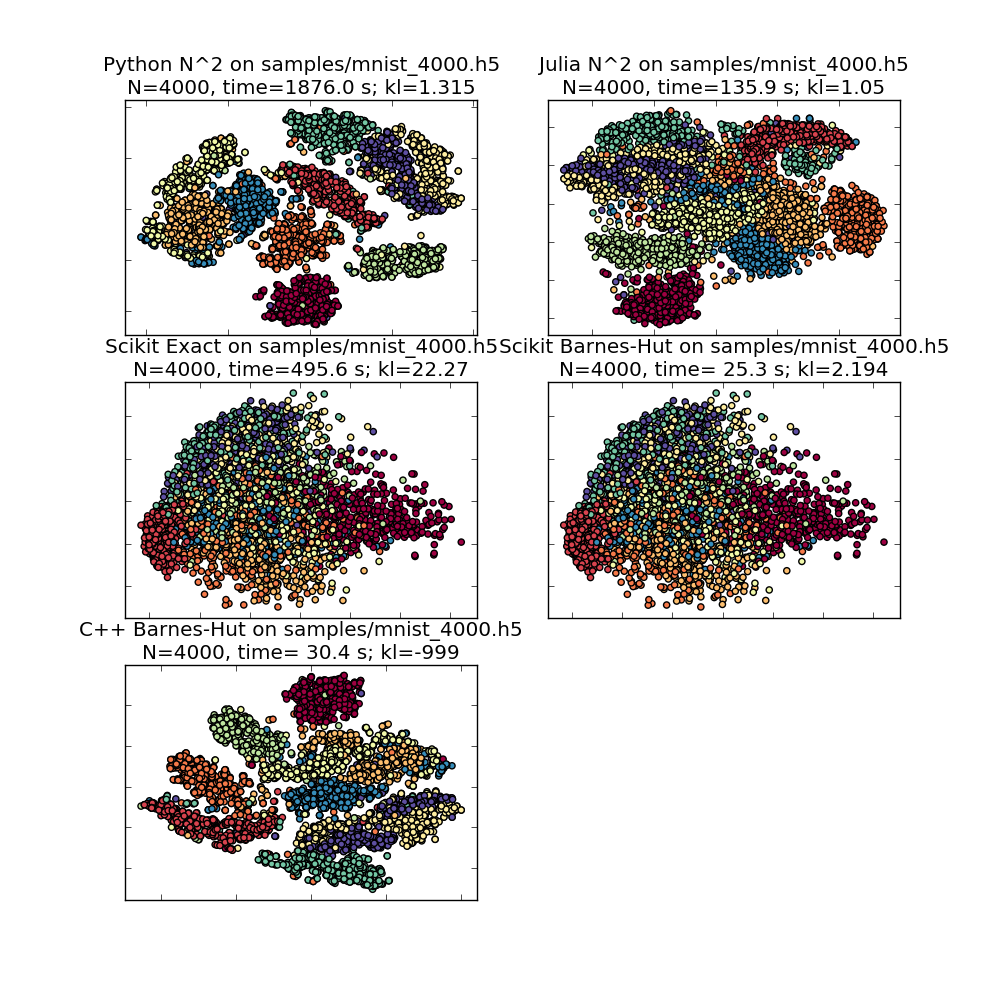
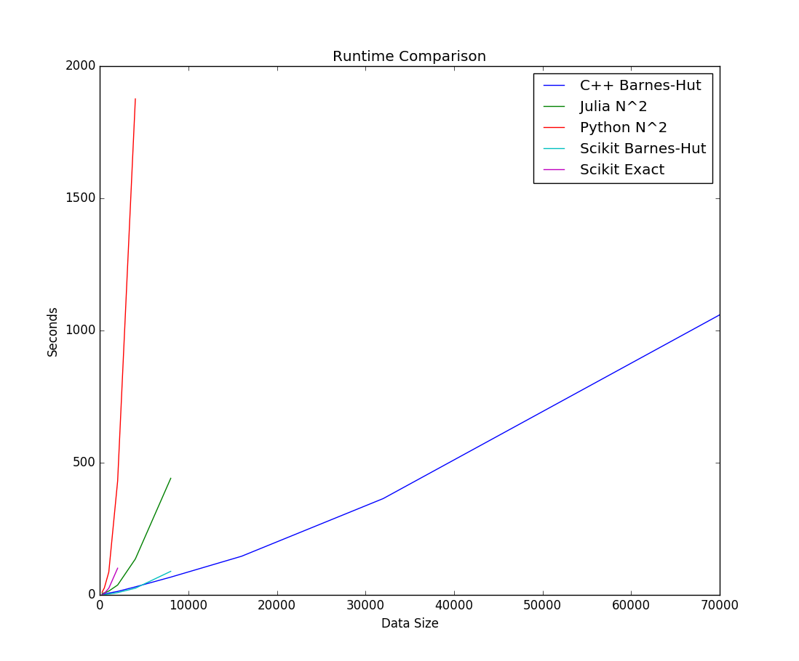
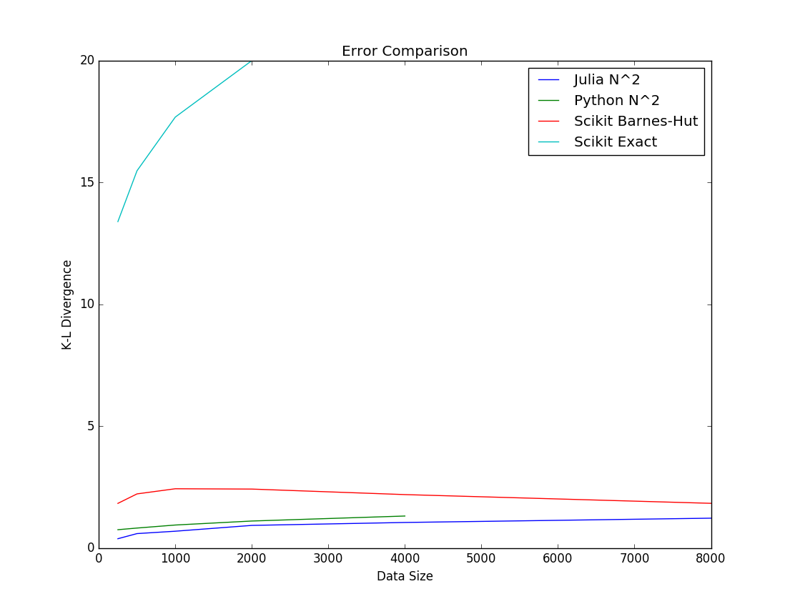

# Overview

This is the first interim progress report for the Scalable t-SNE project.
t-SNE is an algorithm for embedding high dimensional data into a low
dimensional space (2-D or 3-D) for visualization purposes.  This report
includes an analysis of five existing t-SNE implementations using the MNIST
data set.  In addition, some preliminary steps taken to develop an online
version of Barnes-Hut t-SNE Julia are described.

# Creation of MNIST subsets

To test various t-SNE implementation, we use the popular MNIST dataset for our
sample data.  A script was created to read binary input data files, create a
random subset of the full 70,000 point data set, and write the result to an
HDF5-format file.  The script was used to generate sample data in a wide range
of sizes: 250, 500, 1000, 2000, 4000, 8000, 16000, 32000, 70000 (full set).
This range of sizes makes it possible to test the both the convergence and
runtime performance of various t-SNE implementations.

# Comparison of t-SNE implementations

The following implementations of t-SNE were used in testing:

  - `Python N^2` -- a $\mathcal{O}(n^2)$ implementation from the author,
  - `Julia N^2` -- a Julia translation of the same $\mathcal{O}(n^2)$ implementation,
  - `Scikit Exact` and `Scikit Barnes-Hut` -- Scikit Learn is a popular machine
     learning framework for Python which includes both the Exact $\mathcal{O}(n^2)$
     and Barnes-Hut $\mathcal{O}(n \log n)$ versions of the algorithm, and
  - `C++ Barnes-Hut` -- a C++ implementation of the Barnes-Hut $\mathcal{O}(n \log n)$
     versions of the algorithm supplied by the author.

Library code was downloaded and driver scripts (in Python or Julia) were
created to run each of the above algorithms and save the results.  Separate
scripts were created for visualizing the results and comparing the runtime
performance of the algorithms.  Some of the output of these scripts is shown
in the next subsection:

## Output Visualization

In the results below, all implementations have been configured using a
perplexity of 20.0 and a maximum of 1000 iterations.  Implementations which
preprocess the data using a PCA dimensionality reduction technique have been
configured to use 50 output dimensions.

Figure 1 shows the output of each of the five algorithms, using a
random 4000 point sample of the MNIST data as input.  The `Python N^2` and
`Julia N^2` implementations produce similar results, however the former
exhibits clusters that are more well-separated than the latter.  (This may be
due to a *possible* bug in the Julia implementation which subtracts the minimum
distance neighbor from all other distances when solving for the variance that
gives the target perplexity.)

Both the `Scikit Exact` and `Scikit Barnes-Hut` implementations
have bugs in the optimizers causing poor results.  This is apparent both in
the quality of the visualization and the K-L divergence statistic.  There is
an [issue](https://github.com/scikit-learn/scikit-learn/issues/6204)
documenting this defect.  Recent development on a new branch appears to have
corrected this bug, however it has not yet been released as part of Scikit
Learn.

Finally, the C++ Barnes-Hut implementation appears to produce results that are
visually consistent with the $\mathcal{O}(n^2)$ algorithms.

## Algorithm Performance

Figure 2 shows a comparison of runtime results for the various algorithms.
It is immediately apparent that there are vast differences in the runtimes,
owing to the nature of the algorithm (Exact $\mathcal{O}(n^2)$ or Barnes-Hut
$\mathcal{O}(n \log n)$).

The `Python N^2`, `Scikit Exact`, and `Julia N^2` algorithms all exhibit
$\mathcal{O}(n^2)$ performance, however their runtimes differ by a factor of
approximately 4x, with the Julia implementation performing the best.  (This is
unsurprising, since Julia is a dynamically compiled language, whereas the
Python implementations are a hybrid of interpreted scripting and precompiled
libraries.)

The `Scikit Barnes-Hut` implementation seems to scale almost as well as as the
`C++ Barnes-Hut` implementation, however it is not possible to measure the
Scikit code for sizes larger than 8,000 points due to a bug which causes
excessive $\mathcal{O}(n^2)$ memory consumption.  The presence of this bug means
that, even if sufficient memory could be allocated, the algorithm's
performance would likely worsen significantly for larger N.  This is a [known
issue](https://github.com/scikit-learn/scikit-learn/issues/8582), and steps
are being taken to correct this.

Overall, the `C++ Barnes-Hut` implementation is the clear winner, and it
scales delivering  $\mathcal{O}(n \log n)$ performance scaling all the way up
to the full 70,000 points in the MNIST data set.

Figure 3 compares the the K-L divergence of each algorithm, as reported
by the algorithm following the final iteration.  Comparing the errors of
various algorithms, we see that most algorithms exhibit an average K-L
divergence around 2.5 of less.  The one exception is the Scikit Learn Exact
algorithm.  As already observed, both Scikit Learn implementations (version 0.18.2)
are malfunctioning.  Unfortunately, it is difficult to extract the K-L
divergence of the `C++ Barnes-Hut` implementation, and that information has not
been included in this plot.

# Development of Online t-SNE solution

Work has commenced on developing an online implementation of t-SNE in Julia.
At the time of this report, the following have taken place:

## Implementation of VP-trees

In the project proposal, we considered using an existing library for the
Vantage-Point tree (VP Tree) data structure required by the Barnes-Hut
optimizations in t-SNE.  After further review of the existing `VPTrees.jl`
library, certain deficiencies were uncovered, making it unsuitable
for use by the project.  Specifically, the library offers no support for
inserting or removing points from an existing tree.

To remedy this, we have developed a different implementation of VPTrees in
Julia which supports creating trees and dynamically inserting points.  Support
for removing points from a VPTree is challenging, since deleting an
intermediate node can require a full rebuild of all subtrees below that node.
We would like to avoid any situation that causes a sudden requirement to
rebuild the full tree (or a large portion) since this would create a processing
stall that might be unacceptable for an online algorithm. However, we observe
that most nodes in a tree are close to the leaves, and consequentially have
few descendants. Therefore, an approach which removes and rebalances when the
target node is near a leaf, and marks a node as unavailable for search (when
it is higher up in the tree) may be feasible.

## Computing point perplexities

An early implementation of the algorithm to solve for the variance which
results in the desired perplexity for each high-dimensional data point now
exists.  We will likely use the original points (in an unreduced space) for
computing pairwise distances.  This means that it is critical that we be able
to compute distances efficiently, and are there using a memory-limited cache
to accelerated repeat VP-Tree searches when solving for point perplexities.

It has also been discovered that having an efficient implementation of the
distance function (Euclidean 2-norm, in the case of MNIST) is essential.
Memory layout of the data, and avoiding the creation of any temporary arrays
is essential to obtaining acceptable performance.

For a fixed VP-Tree, solving for the variances of multiple points is
embarrassingly parallel.  A multi-threaded or multi-process approach could
yield a 4-8x speedup for typical consumer-grade hardware, and could be used
to gain more significant speed-ups on high-end workstations.

## Visualization libraries

One major goal of this project is to create an animation which shows an
ongoing process of t-SNE convergence whilst new data points are injected.
It was recommended that we begin investigating graphics libraries for
performing this visualization.  We have discovered that the `SMFL` library
for Julia allows creation of animated points, and appears to be able
to support approximately 20,000 points at an update rate close to 30
frames-per-second.

# Summary

We have completed a review of existing t-SNE implementations, compared their
performance, and have taken steps in the development of a new, online
implementation of t-SNE.  This progress meets several of our early goals,
and we feel the project is on track to deliver a working algorithm.
